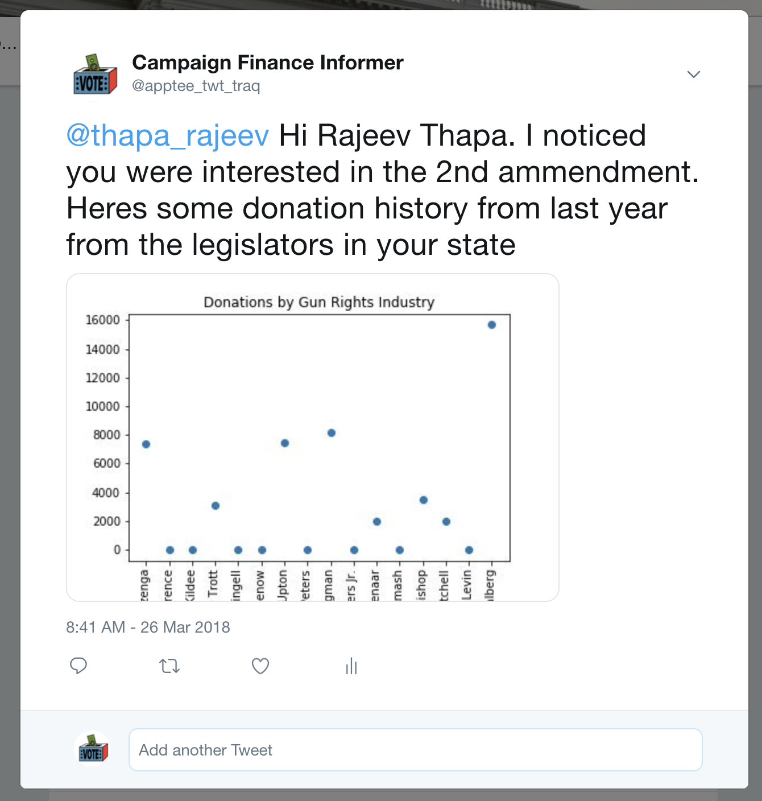

# Congressional Donations TwitterBot
A twitter bot that informs twitter users about their congression leader's politial donations. 

## The Big Idea:
These days, it seems like almost anything is for sale, including our democracy. We want to shed light on campaign contributions and their potential effect on policy. Specifically, I want to help answer the question: is there a correlation between campaign contributions and legislation votes?
 
## System Overview
I wanted to build a user-friendly application that would enable users to easily access data on campaign contributions and legislation votes. Twitter, a social media platform that has recently risen in political influence, seemed to be a natural platform to interface with users and seamlessly provide the electorate with information about their state legislators. I built a twitter bot that located users who have tweets with hashtags of political topics like, ‘2nd amendment’ or 'abortion', and would then tweet back data visualizations of that user’s state legislators campaign contributions by parties both for and against that political topic.

 
## Technical Aspects
I built a twitter bot in python than utilized both the [Twitter API](https://developer.twitter.com/en/docs/tweets/search/overview) and [Open Secrets API](https://www.opensecrets.org/open-data/api). The Twitter API was used to search for tweets with the hashtag ‘2nd amendment.’ It then parsed the location data of the tweet’s author, and called the Open Secrets API to obtain data about the legislators in that user’s state. I used the matplotlib library to create data visualizations of the campaign contributions to the state legislators from parties who opposed and supported gun rights. Finally, using the Twitter API, these visualizations are tweeted back to the author of the original tweet.
